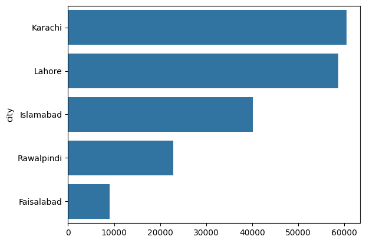
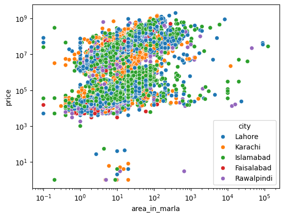
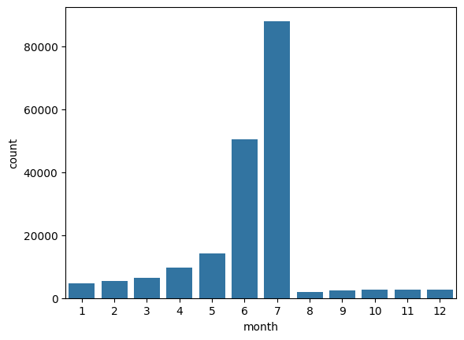
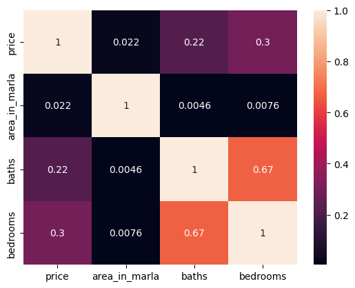

# 🏠 Pakistan Real Estate Market Analysis

An exploratory data analysis of **191,393 property listings** across Pakistan (Aug 2018 – Aug 2019), uncovering pricing patterns, city-level demand, seasonal listing trends, and market anomalies.

[](https://colab.research.google.com/github/MMujtabaX/pakistan-real-estate-eda/blob/main/EDA_Portfolio_Project.ipynb)


## 📌 Overview

The dataset contains property listings with price, location, city, province, property type, area, bedrooms, baths, purpose (sale or rent), listing date, and agency or agent details. The analysis answers practical questions a buyer, investor, or real estate agency would ask about Pakistan's property market.

## 🔄 Workflow

| Phase | Stage | What was done |
|-------|-------|---------------|
| 1 | Data loading | Loaded 191K rows × 17 features with date parsing |
| 2 | Cleaning | Dropped ID, URL and coordinate columns; filled missing agency and agent values (~25%) with `Unknown`; converted mixed Kanal/Marla area strings into a single `area_in_marla` column |
| 3 | Outlier detection | Box plots, skewness checks and IQR analysis on price and area |
| 4 | EDA | Univariate, bivariate and multivariate analysis on log scales |
| 5 | Business Q&A | Answered market questions on demand, pricing, agencies and seasonality |

## 🔍 Key Findings

- **Karachi and Lahore dominate the market,** with 60,484 and 58,736 listings. Islamabad (40,195), Rawalpindi (22,898) and Faisalabad (9,080) follow.
- **Prices are extremely skewed** (skewness ≈ 9.5). The median listing is PKR 7.3M, but prices reach PKR 2B, so log-scale analysis was essential.
- **Listings are highly seasonal.** June and July alone account for **~72%** of all listings.
- **Islamabad is a renters' market.** It is the only major city with more rental listings (22,976) than sale listings (17,219).
- **Premium locations defy size logic.** Small properties with top-10% prices cluster in **DHA Defence (Lahore)** and **F-7 / F-11 / E-11 (Islamabad)**, where location value outweighs area.
- **About a quarter of listings have no agency attached,** which points to a large direct-owner segment.
- **High-value properties (> PKR 50M)** grew sharply from 2018 to 2019, led by Islamabad with 2,362 listings in 2019.

## 📊 Visualizations






## 🛠️ Tech Stack

Python · Pandas · NumPy · Matplotlib · Seaborn · Google Colab

## 🚀 Getting Started

```bash
git clone https://github.com/MMujtabaX/pakistan-real-estate-eda.git
cd pakistan-real-estate-eda
pip install -r requirements.txt
jupyter notebook EDA_Portfolio_Project.ipynb
```

The notebook loads the dataset directly from a hosted CSV link, so no manual download is needed.

## ⚠️ Limitations & Future Work

- Sale and rental prices are on very different scales. Analyzing them separately would give cleaner price insights.
- Listings with a price or area of 0 and data-entry errors (e.g. a listing with 403 baths) should be filtered out before modeling.
- Outliers were identified but not removed. A cleaned subset could support a **price prediction model** as a next step.
- Geospatial mapping using the latitude and longitude columns.

## 📚 Dataset

Pakistan property listings dataset (Zameen.com, 2018–2019).

## 👤 Author

**Muhammad Mujtaba Khan Suri** — CS @ UBIT, University of Karachi
[GitHub](https://github.com/MMujtabaX)
